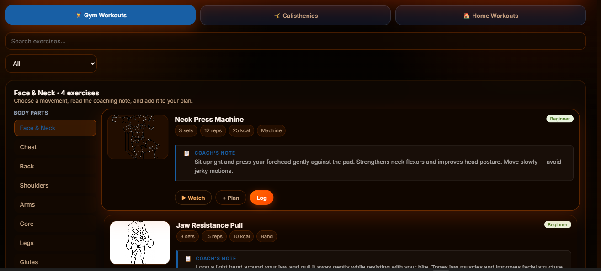

# Viteflow - Fitness Tracker & Companion

A modern, responsive, and beautiful fitness tracking web application built with React, Vite, and Framer Motion.


## Features

- **Exercise Library:** A comprehensive library of gym and calisthenics exercises with proper form illustrations.
- **Yoga Poses:** A detailed collection of yoga poses across different styles (Hatha, Vinyasa, Ashtanga, Yin) with real-life demonstration photos.
- **Calorie Tracker:** Track your daily caloric intake and macronutrients to stay on top of your diet goals.
- **Progress Tracking:** Monitor your fitness journey with visual progress indicators.
- **Workout Planner:** Plan your workouts efficiently.
- **Beautiful UI:** A sleek, dark-themed user interface with smooth micro-animations powered by Framer Motion.

## Technologies Used

- **React:** For building the user interface.
- **Vite:** Next-generation frontend tooling for fast builds and hot module replacement.
- **Framer Motion:** For fluid and engaging animations.
- **CSS:** Custom styling for a unique and professional look.

## Getting Started

### Prerequisites

- Node.js (v14 or higher recommended)
- npm or yarn

### Installation

1. Clone the repository:
   ```bash
   git clone https://github.com/Akhilesh165/Akhilesh165.git
   ```
2. Navigate to the project directory:
   ```bash
   cd Akhilesh165
   ```
3. Install dependencies:
   ```bash
   npm install
   ```
4. Create a local environment file:
   ```bash
   cp .env.example .env
   ```
   Then edit `.env` and add your MongoDB connection string and JWT secret.
5. Start the development server:
   ```bash
   npm run dev
   ```

## Screenshots



## Contributing

Contributions are what make the open-source community such an amazing place to learn, inspire, and create. Any contributions you make are **greatly appreciated**.

If you have a suggestion that would make this better, please fork the repo and create a pull request. You can also simply open an issue with the tag "enhancement".
Don't forget to give the project a star! Thanks again!

1. Fork the Project
2. Create your Feature Branch (`git checkout -b feature/AmazingFeature`)
3. Commit your Changes (`git commit -m 'Add some AmazingFeature'`)
4. Push to the Branch (`git push origin feature/AmazingFeature`)
5. Open a Pull Request

## License

This project is licensed under the MIT License.

## Deployment

This repository is set up to deploy the frontend to Vercel and the backend as a separate Node service (Render, Heroku, Railway, etc.).

Frontend (Vercel)
- The root contains `vercel.json` configured to run `npm run build` and serve the `dist` directory.
- In the Vercel project settings set the root to this repository, build command to:

```bash
npm run build
```

and the Output Directory to:

```
dist
```

API (Render / Heroku / Railway)
- This project exposes the backend in `server/server.js` and includes a `Procfile` for simple deployments (`web: node server/server.js`).
- Required environment variables for the API:
   - `MONGODB_URI` — MongoDB connection string
   - `JWT_SECRET` — secret for signing JWTs
   - `PORT` — optional, default 5000

Render (example)
1. Create a new Web Service on Render.
2. Connect your GitHub repository and select the repo.
3. Use `Node` environment; set the build command to `npm install && npm run build` and the start command to `npm start`.
4. Add the environment variables (`MONGODB_URI`, `JWT_SECRET`) in the service settings.

Heroku (example)
1. Create a new Heroku app.
2. Connect GitHub repo or push via Git.
3. Ensure the `Procfile` exists (`web: node server/server.js`).
4. Set config vars in Heroku dashboard: `MONGODB_URI`, `JWT_SECRET`.

Notes
- If you deploy the frontend separately to Vercel, you can remove the static-serving block in `server/server.js` — it is harmless but not required.
- The API will return `503 Service Unavailable` for `/api/*` endpoints if the database is not connected; this prevents partial failures.

If you'd like, I can prepare ready-to-deploy templates for Render or a GitHub Actions workflow to deploy the frontend to Vercel and backend to Render automatically.

CI / CD with GitHub Actions
---------------------------------
This repository includes a GitHub Actions workflow at `.github/workflows/deploy.yml` that:

- Builds the frontend and deploys it to Vercel using the Vercel GitHub action.
- Triggers a backend deploy on Render via its REST API.

Required GitHub repository secrets (set these in your GitHub repo Settings → Secrets):

- `VERCEL_TOKEN` — A Vercel Personal Access Token with project permissions.
- `VERCEL_ORG_ID` — Your Vercel organization ID.
- `VERCEL_PROJECT_ID` — The Vercel project ID for this frontend.
- `RENDER_API_KEY` — A Render API key (service deploy permissions).
- `RENDER_SERVICE_ID` — The Render service ID for your backend.

How it works
1. Push to `main` triggers the workflow.
2. The `frontend` job installs dependencies, runs `npm run build`, and calls the Vercel Action to deploy the `dist` directory to production.
3. After successful frontend deployment, the `backend` job calls Render's deploy API to create a new backend deploy.

Notes
- To obtain Vercel IDs and tokens, visit your Vercel dashboard and create a Personal Token and find the org/project IDs under project settings.
- For Render, create an API key in the Render dashboard and find the service ID on the service's settings page.
- If you prefer automatic Git-based deploys on Render, you can also connect the repo directly in Render and skip the API-trigger job.
